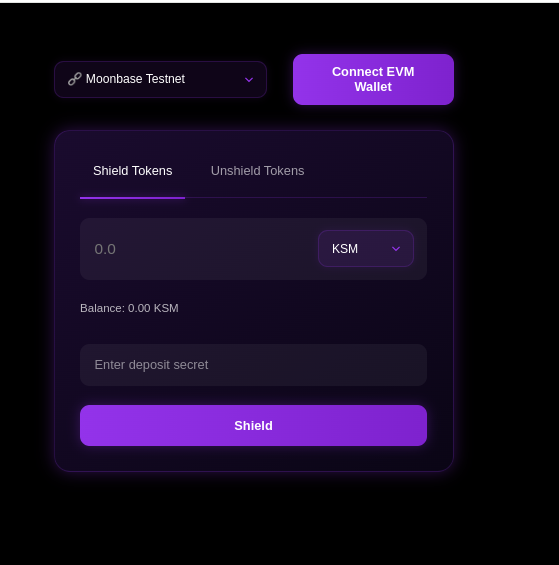
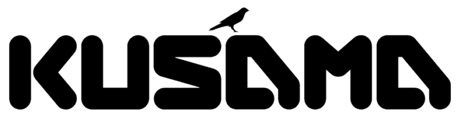

# Interface

Kusama Shield User interface


## Note:
Use with **Google Chrome and Talisman browser wallet**

## Documentation:     
https://kusamashield.codeberg.page

## Landing page:    
https://shield.markets   

### License: 
MIT, see LICENSE file.

### Clone: 
```shell
git clone https://codeberg.org/KusamaShield/Interface && cd Interface/
```

### Install:

#### Build wasm packages: 
```shell
cargo install wasm-pack
wasm-pack build --target web
rm -rf public/pkg/
cp -r pkg/ public/
```

#### Install node packages:
```shell
npm install -f
```


### Run:  
```shell
npm run dev
```
### Test link:


### Screenshots:  


## Tested on:  
Linux + Google Chrome + Talisman Browser Wallet


### Supported Chains:      
#### Testnet:   
-  [x] Moonbase Testnet  
-  [x] Westend Assethub  
-  [x] Paseo hub
#### Mainnet:  
-  [x] Kusama Assethub    

## Project supported by:   
      


